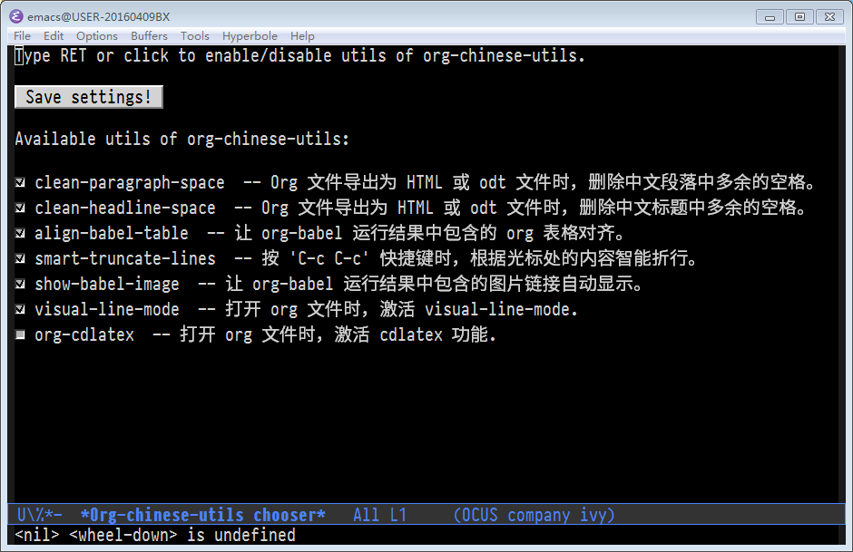

- [org-chinese-utils README](#org-chinese-utils-readme)
  - [介绍](#介绍)
  - [安装](#安装)
  - [设置](#设置)
  - [管理个人 utils](#管理个人-utils)

# org-chinese-utils README

## 介绍

org-chinese-utils 是一个 org-mode 小工具管理器，可以方便 org-mode 中文用户：

1.  将 org 文件导出为 HTML/ODT 文件时，删除不必要的空格。
2.  按 'C-c C-c', 根据当前内容智能折行。
3.  如果 org-babel 结果中包含表格时，对表格进行对齐处理。
4.  &#x2026;

## 安装

1.  配置melpa源，参考：<http://melpa.org/#/getting-started>
2.  M-x package-install RET org-chinese-utils RET
3.  在emacs配置文件中（比如: ~/.emacs）添加如下代码：

        (require 'org)
        (require 'org-chinese-utils)
        (ocus-enable)

## 设置

运行下面的命令后，会弹出一个选择器，用户用鼠标或者回车选择需要激活的 utils 就可以了。

    M-x org-chinese-utils

## 管理个人 utils

用户可以使用 org-chinese-utils 管理自己的小工具，比如：

    (add-hook 'org-mode-map 'my-hello-world)
    (defun my-hello-world ()
      (message "Hello world!"))

可以转换为 org-chinese-utils 配置：

    (push '(hello-world
            :document "Hello world!"
            :function my-hello-world
            :hook org-mode-hook)
          ocus-config)

如果用户想将自己的小工具集成到 org-chinese-utils, 可以到 [这里](https://github.com/tumashu/org-chinese-utils/issues)
提交 Issue. 并贴出小工具的的配置。
